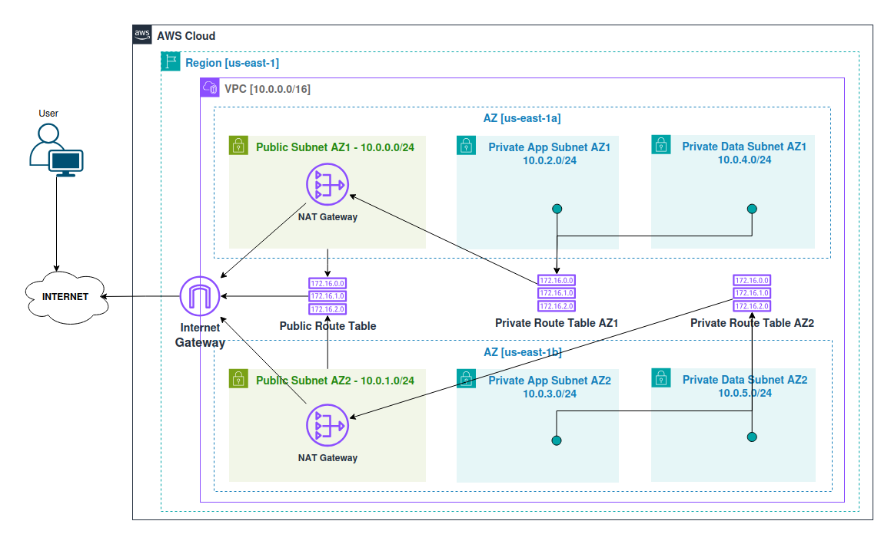

# Week 3: Complete VPC Networking
This module covers the creation of a secure, multi-tier AWS VPC with public and private subnets across multiple availability zones. NAT gateways and route tables enable controlled internet access for private resources, ensuring high availability, scalability, and security. This custom VPC is ideal when you need to operate in a separate VPC instead of the default one.





## 1. Objective
Build a secure AWS VPC network with public and private subnets, NAT gateways, and route tables to enable safe communication between application and data layers while allowing controlled internet access.

## 2. Cloud Skills Covered
- Configured VPC and subnets across multiple AZs.
- Created and associated public and private route tables.
- Deployed Internet and NAT gateways for secure connectivity.
- Enabled DNS hostnames for resource accessibility.
- Designed a high-availability, segmented network for security and scalability.

## 3. Table of VPC Network Elements Created

| Element | Name | CIDR / AZ | Purpose |
|---------|------|-----------|---------|
| VPC | Dev VPC | 10.0.0.0/16 | Primary virtual network |
| Internet Gateway | Dev Internet Gateway | - | Provides public internet access |
| Public Subnet AZ1 | Public Subnet AZ1 | 10.0.0.0/24 | Hosts NAT Gateway, public-facing resources |
| Public Subnet AZ2 | Public Subnet AZ2 | 10.0.1.0/24 | Hosts NAT Gateway, public-facing resources |
| Private App Subnet AZ1 | Private App Subnet AZ1 | 10.0.2.0/24 | Hosts application servers |
| Private App Subnet AZ2 | Private App Subnet AZ2 | 10.0.3.0/24 | Hosts application servers |
| Private Data Subnet AZ1 | Private Data Subnet AZ1 | 10.0.4.0/24 | Hosts databases or storage resources |
| Private Data Subnet AZ2 | Private Data Subnet AZ2 | 10.0.5.0/24 | Hosts databases or storage resources |
| NAT Gateway AZ1 | NAT Gateway AZ1 | - | Enables private subnets in AZ1 to access the internet |
| NAT Gateway AZ2 | NAT Gateway AZ2 | - | Enables private subnets in AZ2 to access the internet |
| Public Route Table | Public Route Table | - | Routes public subnet traffic to the Internet Gateway |
| Private Route Table AZ1 | Private Route Table AZ1 | - | Routes private subnets in AZ1 through NAT Gateway AZ1 |
| Private Route Table AZ2 | Private Route Table AZ2 | - | Routes private subnets in AZ2 through NAT Gateway AZ2 |


## 5. AWS VPC Console Setup Guide

Follow this guide to create a fully functional VPC network in AWS using the console.

```init

## 1. Create a new VPC
- Go to **VPC > Your VPCs > Create VPC**
- Name: `Dev VPC`
- IPv4 CIDR block: `10.0.0.0/16`
- Resource: VPC Only
- Click **Create**

## 2. Enable DNS Hostnames
- VPC > Your VPCs > select `Dev VPC` > Edit VPC settings
- Tick **Enable DNS hostnames** > Save

## 3. Create an Internet Gateway and attach to the VPC
- VPC > Internet Gateways > Create Internet Gateway
- Name: `Dev Internet Gateway`
- Select it > Actions > Attach to VPC > select `Dev VPC`

## 4. Create 2 Public Subnets
- VPC > Subnets > Create Subnet
  - VPC ID: `Dev VPC`
  - Name: `Public Subnet AZ1`
  - AZ: us-east-1a
  - IPv4 CIDR: 10.0.0.0/24
  - Click **Create**
- Repeat for `Public Subnet AZ2` (us-east-1b | 10.0.1.0/24)

## 5. Enable Auto-Assign Public IP
- Subnets > select `Public Subnet AZ1` > Edit Subnet settings
- Tick **Enable Auto-Assign Public IPv4 address** > Save
- Repeat for `Public Subnet AZ2`

## 6. Create Public Route Table
- VPC > Route Tables > Create route table
- Name: `Public Route Table`
- VPC: `Dev VPC` > Create
- Edit Routes > Add route `0.0.0.0/0` → Target: `Dev Internet Gateway` > Save

## 7. Associate Public Subnets to the Public Route Table
- Route Tables > `Public Route Table` > Subnet associations > Edit subnet associations
- Select `Public Subnet AZ1` and `Public Subnet AZ2` > Save

> Note: A subnet is public if it is associated with a route table that has a route to an Internet Gateway.

## 8. Create 4 Private Subnets
- VPC > Subnets > Create Subnet
  - Name: `Private App Subnet AZ1` | AZ: us-east-1a | CIDR: 10.0.2.0/24
  - Name: `Private App Subnet AZ2` | AZ: us-east-1b | CIDR: 10.0.3.0/24
  - Name: `Private Data Subnet AZ1` | AZ: us-east-1a | CIDR: 10.0.4.0/24
  - Name: `Private Data Subnet AZ2` | AZ: us-east-1b | CIDR: 10.0.5.0/24
- Click **Create** for each

## 9. Create NAT Gateways in Public Subnets
- VPC > NAT Gateways > Create NAT Gateway
- Select `Public Subnet AZ1` > Allocate Elastic IP > Name: `NAT Gateway AZ1` > Create
- Repeat for `Public Subnet AZ2` > `NAT Gateway AZ2`

## 10. Create Private Route Tables
- VPC > Route Tables > Create route table
  - Name: `Private Route Table AZ1` | VPC: `Dev VPC` > Create
  - Edit Routes > Add route `0.0.0.0/0` → Target: `NAT Gateway AZ1` > Save
  - Subnet associations > Add `Private App Subnet AZ1` & `Private Data Subnet AZ1` > Save
- Repeat for `Private Route Table AZ2` → NAT Gateway AZ2 → Associate `Private App Subnet AZ2` & `Private Data Subnet AZ2`

## Diagram
- Refer to **diagram.png** for the network layout including VPC, subnets, route tables, and NAT gateways.

```