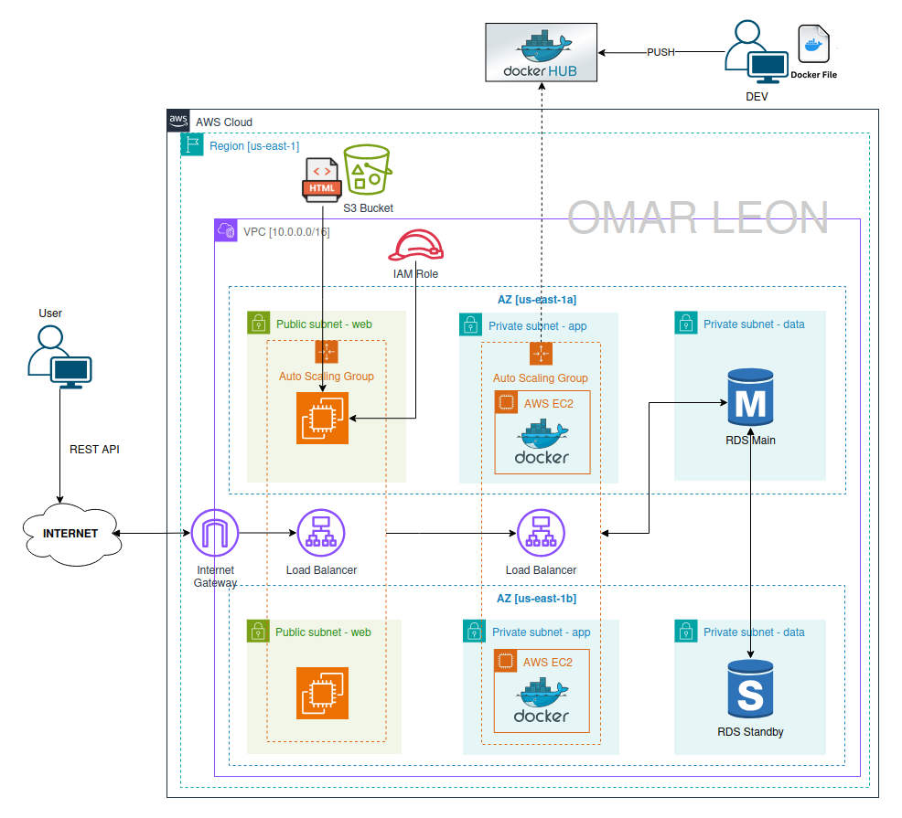

# Week 3: High Available 3 Tier Architecture
The Library Management System is a backend API built with FastAPI that provides endpoints to manage books, users, and borrowing transactions. The system supports full CRUD operations and uses a MySQL database for persistent data storage. This module focuses on containerizing the application using Docker and deploying it in the AWS Cloud with RDS (for the database) and EC2 (for the application container).




## 1. Objective
Design a cloud-based deployment strategy using Docker Container, Docker Hub, AWS EC2 and RDS Database.

## 2. Deployment Strategy
The deployment uses a hybrid approach with local container testing and cloud hosting on AWS.
 - **Local**: The FastAPI app and MySQL database run in containers using Docker for production-like testing. The verified image is then pushed to Docker Hub.
 - **Cloud**: An EC2 instance hosts the app container connected to an RDS MySQL database. Security Groups manage access — web-sg for API traffic (port 8000) and db-sg for database access (port 3306).
 - **Validation**: Connectivity is tested via FastAPI’s /docs and CURL commands.

## 3. Tech Stack

- **FastAPI** – Backend API framework
- **MySQL (RDS)** – Managed relational database
- **Docker / docker-compose** – Containerization and local orchestration
- **Docker Hub** - Docker Registry
- **AWS EC2** – Cloud hosting for the app container
- **Git** – Version control
- **Security Groups** – Network access control


## 4. Cloud Skills Covered

- Designed and deployed a containerized FastAPI app from local to AWS.
- Built and managed Docker images via Docker Hub.
- Used environment variables for secure configuration on EC2.
- Configured AWS RDS (MySQL) and linked it to the app container.
- Automated EC2 setup with User Data scripts.
- Isolate App <–> Database communication using Security Groups.

## 5. Deployment

### 5.a. EC2/Docker + ALB + ASG + RDS (AWS Console)

Create 2 Security Groups in: AWS Console > EC2 > Security Groups > Create Security Group
```init
    - web-sg
    - app-sg

    
    
    - web-sg
        - Security group name: web-sg
        - Description: web-sg
        - Add Inbound Rule: TCP/8000/source(0.0.0.0/0)
    - db-sg
        - Security group name: db-sg
        - Description: db-sg
        - Add Inbound Rule: TCP/3306/source(web-sg)
```

Spin up an RDS database: AWS Console > RDS > Create database
```init
    - Choose a database creation method: Standard create
    - Engine: MySQL
    - Engine version: MySQL 8.0.42
    - Availability and durability: Multi-AZ
    - DB instance identifier: db-lib-mgmt
    - Master username: root
    - Master password: ******8
    - DB instance class: db.t3.micro
    - Storage: gp2/20GB
    - VPC: Default
    - Public access: No
    - VPC security groups: data-sg
    - DB subnet group: default (all subnets)
    - Initial database name: mydb
    - Enable automated backup: Checked
    - Once RDS is active, copy the connection endpoint
```

Spin up an EC2 Server with Docker inside: AWS Console > EC2 > Launch an instance
```init
    - Name: backend-api
    - OS: Amazon Linux 2023
    - Instance type: t3.micro
    - Key pair: Yes
    - VPC: Default
    - Security Group: web-sg
    - Availability Zone: us-east-1a           # Same AZ as RDS
    - Edit the ec2_user_data script: RDS username, password and endpoint
    - User Data: Use the edited script

# Test connectivity with the CURLs using Endpoints and CURLs (Section 6), browser or <ec2_ip_server>:8000/docs
```

## 6. Endpoints and CURLs

| Method | Endpoint                                 | Description         |
|--------|------------------------------------------|---------------------|
| POST   | `/users/`                                | Create a new user   |
| GET    | `/users/`                                | List all users      |
| POST   | `/books/`                                | Create a new book   |
| GET    | `/books/`                                | List all books      |
| POST   | `/books/{book_id}/borrow/{user_id}`      | Borrow a book       |
| POST   | `/books/{book_id}/return/{user_id}`      | Return a book       |

### CURLs
Replace <URL>:<port> with your server address (e.g., http://localhost:8000)
```bash
# Create a new user
curl -X POST <URL>:<port>/users/ -H "Content-Type: application/json" -d '{"name": "Alice"}'

# List all users
curl <URL>:<port>/users/

# Create a new book
curl -X POST <URL>:<port>/books/ -H "Content-Type: application/json" -d '{"title": "1984", "author": "George Orwell"}'

# List all books
curl <URL>:<port>/books/

# Borrow a book (book_id=1, user_id=2)
curl -X POST <URL>:<port>/books/1/borrow/2

# Return a book (book_id=1, user_id=2)
curl -X POST <URL>:<port>/books/1/return/2
```

## 7. Project Structure

```bash
library-management/
├── app                         # FastAPI application code (routes, models, schemas, etc.)
├── deployment                  # Deployment-related files and scripts
│   └── w2_docker_ec2_rds       # Week 2: Docker + EC2 + RDS deployment setup
│       ├── diagram.png         # Architecture diagram for cloud deployment
│       ├── ec2_user_data.sh    # User Data script to configure EC2 and run Docker container
│       └── README.md           # Deployment instructions and notes
├── diagram.png                 # High-level project architecture diagram
├── docker-compose.yml          # To Construct the DB locally for dev tests
├── Dockerfile                  # Instructions to build the FastAPI app container
├── README.md                   # Project documentation
└── requirements.txt            # Python dependencies for the project
```
