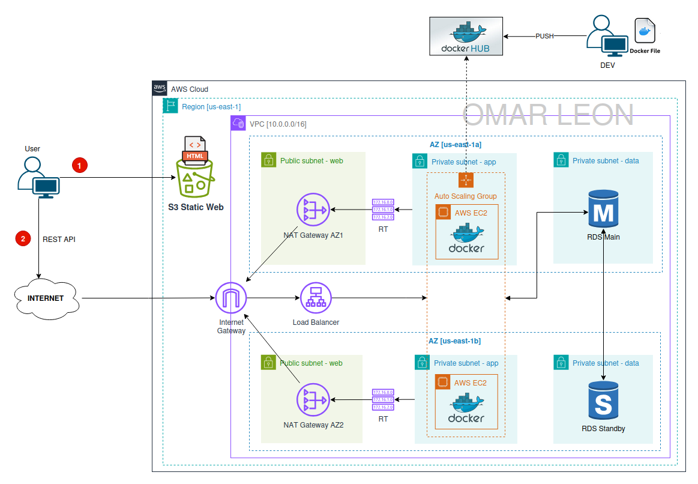

# Week 5: S3 Static Web with a 3 Tier Architecture
This module extends the 3-Tier Architecture by introducing Amazon S3 Static Website Hosting as the Web Tier entry point. The project integrates a public S3 website with an internal FastAPI backend and a Multi-AZ RDS database, completing the web–app–data workflow. This setup demonstrates how to offload static content to S3 while maintaining secure, scalable backend layers.

---




---

## 1. Objective
Deploy a static web frontend on S3 that communicates with the FastAPI backend running in a Highly Available 3-Tier Architecture. The objective is to enhance scalability, reduce load on the Web tier, and follow AWS best practices for static hosting, networking, and secure API access.

---

## 2. Deployment Strategy
The deployment approach connects the static frontend to the backend services:

### S3 Static Web Hosting
- Public S3 bucket hosting index.html as the web entry point.
- Static Website Hosting enabled with public read access.

### Backend Connectivity
- The S3 frontend sends API requests to the App Tier ALB.
- The existing 3-Tier environment from Week 4 is reused for backend logic and database operations.

### Security & IAM
- Public bucket policy for read-only access.
- Backend access controlled through existing Security Groups and private subnets.

---

## 3. Tech Stack
### Frontend
- HTML / JavaScript hosted on Amazon S3

### Backend
- FastAPI (Python)
- Amazon RDS MySQL Multi-AZ

### AWS Services
- Amazon S3 (Static Web Hosting)
- VPC
- EC2 + Auto Scaling Groups
- Application Load Balancers + Target Groups
- Security Groups

### Tools
- Git
- Bash scripts
- Docker / Docker Hub

---

## 4. Cloud Skills Covered

- Hosting static websites using Amazon S3.
- Integrating S3 frontends with backend ALBs in a multi-tier architecture.
- Applying bucket policies for secure public access.
- Connecting S3-hosted web apps to private backend services.
- Enhancing scalability by separating static and dynamic workloads.
- Using AWS best practices for networking, IAM, and HA architecture.

---

## 5. Deployment $ Configuration Steps (AWS Console)

5.1. Create a New VPC
- Create **Dev VPC** as explained in Week 3 project "VPC Networking".

5.2. Security Groups
```init
### Security Group Table
| Name        | Ports  | Origin        |
|-------------|--------|---------------|
| alb-app-sg  | 80,443 | 0.0.0.0/0     |
| asg-app-sg  | 8000   | alb-app-sg    |
| data-sg     | 3306   | asg-app-sg    |

### Configuration on AWS Console
- VPC > Security Groups > Create Security Group  
- SG name:          alb-web-sg 
- Description:      alb-web-sg
- VPC:              Dev VPC  
- Inbound Rules:  
  - HTTP from anywhere  
  - HTTPS from anywhere

Note: Repeat these steps for the other SG
```

5.3. RDS Subnet Group
```init
- RDS > Subnet Group > Create DB subnet group  
  - Name:           db-subnet-group-multi-az
  - Description:    db-subnet-group-multi-az
  - VPC:            Dev VPC
  - AZs:            us-east-1a, us-east-1b
  - Subnets:  
    - Private Data Subnet AZ1  
    - Private Data Subnet AZ2  
```

5.4. RDS Multi-AZ Deployment
```init
Spin up an RDS instance with:

- RDS > Databases > Create database  
  - Database creation method:   Full configuration
  - Engine type:                MySQL
  - Engine version:             Default
  - Templates:                  Dev/Test
  - Availability & durability:  Multi-AZ DB instance deployment (2 instances)
  - DB instance identifier:     db-lib-mgmt
  - Master username:            root
  - Master password:            ******8
  - DB instance class:          db.t3.micro
  - Storage type:               gp2
  - Allocate storage:           20 GiB
  - VPC:                        Dev VPC
  - DB subnet group:            db-subnet-group-multi-az
  - Public access:              No
  - Security group:             data-sg
  - Initial database name:      mydb

- Once RDS is active → copy the connection `endpoint`.
```

5.5. Application Load Balancers & Target Groups
```init
### App Target Group
- EC2 > Target Groups > Create target group  
  - Target type:            Instances
  - Name:                   app-tg
  - Protocol:               HTTP
  - Port:                   8000
  - VPC:                    Dev VPC
  - Health check protocol:  HTTP
  - Health check path:      "/users/"  
  - Next > Next > Create

---

### App Application Load Balancer
- EC2 > Load Balancers > Create load balancer  
  - Name:               app-alb
  - Scheme:             Internet-facing
  - AZs and Subnets:  
    - us-east-1a:       Public Subnet AZ1  
    - us-east-1b:       Public Subnet AZ2  
  - Security Group:     alb-app-sg
  - Listener:           HTTP
  - Port:               80
  - Target group:       app-tg

```

5.6. Auto Scaling Groups & Launch Templates
```init
### App Launch Template
- EC2 > Launch templates > Create launch template  
  - Name:                   app-launch-template
  - Description:            app-launch-template  
  - Auto Scaling guidance:  Check
  - Image:                  Amazon Linux 2023 — 64-bit
  - Instance type:          t2.micro
  - Key pair:               select key (myec2key)
  - Security group:         asg-app-sg
  - User data:              paste "app_user_data" script updating DB username, password, and RDS endpoint

Note: "app_user_data" script is inside week 5 project folder.

---

### App Auto Scaling Group
- EC2 > Auto Scaling groups > Create Auto Scaling group  
  - Name:                       app-asg
  - Launch template:            app-launch-template
  - VPC:                        Dev VPC
  - Subnets:                    Private App Subnet AZ1, Private App Subnet AZ2
  - Attach to load balancer:    app-tg
  - Enable ELB health checks:   Check
  - Desired/Min/Max:            2 / 1 / 3
  - Automatic scaling:          Target tracking
    - Metric:                   Average CPU Utilization
    - Target value:             50
  - Monitoring:                 Enable group metrics (CloudWatch)

```

5.7. S3 Bucket - Static Website Hosting
```init
### Create a PUBLIC S3 Bucket
- S3 > Buckets > Create bucket  
  - Bucket type:                General
  - Bucket name:                test-s3-static-web-3-tier-arch
  - Block all public access:    Unchecked
  - "Create bucket"

### Upload the index.html file, that is inside week 5 project folder, to your Bucket.

### Enable Static Website Hosting
- S3 > Buckets > Properties > Edit Static website hosting
  - Static website hosting:     Enable
  - Hosting type:               Hosting type
  - Index document:             index.html

### Add a Public Read Bucket Policy
- S3 > Buckets > Permissions > Edit bucket policy

        {
          "Version": "2012-10-17",
          "Statement": [
            {
              "Effect": "Allow",
              "Principal": "*",
              "Action": "s3:GetObject",
              "Resource": "<my-bucket-arn>/*"
            }
          ]
        }

Note: Replace <my-bucket-arn> with your bucket ARN.

```

5.8. Testing Connectivity
Copoy the "Bucket website endpoint" located at "S3 > Buckets > Properties > Static website hosting"

    http://test-static-web-3-tier-omar.s3-website-us-east-1.amazonaws.com


5.9. Clean Up Resources
```init
### Follow this order to erase resources
- RDS
- Auto Scaling Groups & Launch Templates  
- Load Balancers & Target Groups  
- Security Groups  
- NAT Gateways  
- VPC  
- Elastic IPs
- S3 Bucket  
```

## 6. Endpoints and CURLs

| Method | Endpoint                                 | Description         |
|--------|------------------------------------------|---------------------|
| POST   | `/users/`                                | Create a new user   |
| GET    | `/users/`                                | List all users      |
| POST   | `/books/`                                | Create a new book   |
| GET    | `/books/`                                | List all books      |
| POST   | `/books/{book_id}/borrow/{user_id}`      | Borrow a book       |
| POST   | `/books/{book_id}/return/{user_id}`      | Return a book       |

### CURLs
Replace <URL>:<port> with your server address, in this case with the DNS name of the Web Aplication Load Balancer (e.g., http://internal-app-alb-1945760550.us-east-1.elb.amazonaws.com). You can include or not the port 80.
```bash
# Create a new user
curl -X POST <URL>:<port>/users/ -H "Content-Type: application/json" -d '{"name": "Alice"}'

# List all users
curl <URL>:<port>/users/

# Create a new book
curl -X POST <URL>:<port>/books/ -H "Content-Type: application/json" -d '{"title": "1984", "author": "George Orwell"}'

# List all books
curl <URL>:<port>/books/

# Borrow a book (book_id=1, user_id=2)
curl -X POST <URL>:<port>/books/1/borrow/2

# Return a book (book_id=1, user_id=2)
curl -X POST <URL>:<port>/books/1/return/2
```

## 7. Project Structure

```bash
library-management/
├── app                         # FastAPI application code (routes, models, schemas, etc.)
├── deployment                  # Deployment-related files and scripts
│   └── w2_docker_ec2_rds       
│   └── w3_vpc_networking
│   └── w4_high_available_3_tier_arch
    └── w5_s3_static_web_3_tier_arch
        ├── app_user_data.sh            # User Data script for app launch template
        ├── diagram.png                 # Architecture diagram for cloud deployment
        ├── README.md                   # Deployment instructions and notes    
        └── index.html                  # File with fornt end and API connectivity to the backend
├── diagram.png                 # High-level project architecture diagram
├── docker-compose.yml          # To Construct the DB locally for dev tests
├── Dockerfile                  # Instructions to build the FastAPI app container
├── README.md                   # Project documentation
└── requirements.txt            # Python dependencies for the project
```
