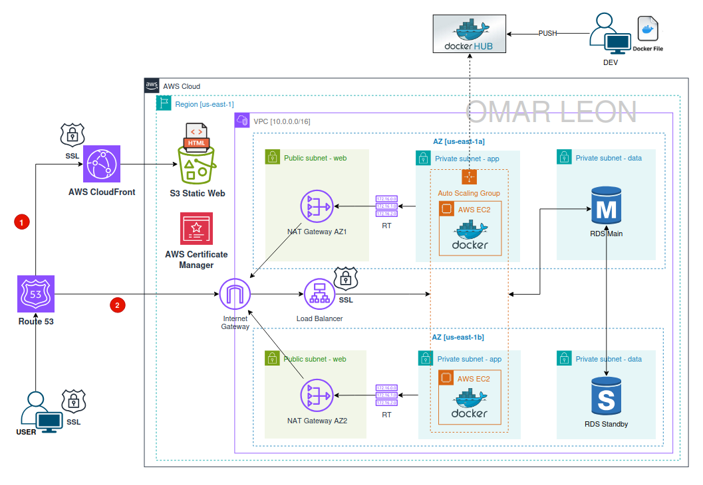

# Week 6: Cloud Front, Route 53 and SSL Certificates
This module focuses on designing and deploying a **highly available 3-Tier Architecture** on AWS for the Library Management System — a backend API developed with FastAPI that manages books, users, and borrowing operations using full CRUD functionality.

The project evolves from local container testing to a **production-grade cloud deployment** using:

* **Docker containers** for packaging the application
* **Amazon EC2 Auto Scaling Groups** for the Web and App tiers
* **Application Load Balancers (ALB)** for traffic distribution
* **Amazon RDS (MySQL)** in **Multi-AZ** mode for fault-tolerant data storage

This module demonstrates how to build an HA infrastructure capable of withstanding AZ failures while maintaining service continuity.

---




---

## 1. Objective
Design and deploy a **Highly Available 3-Tier Architecture** using Dockerized FastAPI services, AWS load balancers, Auto Scaling Groups, and an RDS Multi-AZ database.

The objective is to provide a **scalable, resilient, and production-ready cloud environment** following best practices for networking, IAM, compute, and database operations.

---
Here are **simplified and cleaner versions** of **Sections 2, 3, and 4**, keeping them technical but more concise.

---

## 2. Deployment Strategy
The deployment follows a local-to-cloud workflow:

### **Local Environment**
* The FastAPI application runs in a Docker container.
* MySQL runs via docker-compose for local testing.
* After validation, the image is pushed to Docker Hub.

### **AWS Deployment**
* **Web Tier:** EC2 instances in an Auto Scaling Group behind a public ALB. Apache acts as a reverse proxy to the App Tier.
* **App Tier:** EC2 instances running the FastAPI container, behind an internal ALB.
* **Data Tier:** Amazon RDS MySQL in Multi-AZ for high availability.

### **Networking & Security**
* Security Groups restrict communication between tiers (Web → App → RDS).
* IAM roles allow the Web Tier to fetch the frontend file from S3.
* User Data scripts automate the installation and container startup on EC2.

---

## 3. Tech Stack

### **Application & Database**
* FastAPI (backend)
* MySQL (Amazon RDS Multi-AZ)

### **Containerization & Registry**
* Docker / docker-compose
* Docker Hub

### **AWS Services**
* EC2 + Auto Scaling Groups
* Application Load Balancers (public and internal)
* Amazon S3
* Security Groups
* IAM Roles

### **Supporting Tools**
* Git
* Bash User Data scripts

---

## 4. Cloud Skills Covered

* Designed and deployed a **3-Tier Highly Available Architecture** on AWS.
* Built Docker images and deployed containers on EC2 using User Data.
* Configured a **public Web ALB** and **internal App ALB** for traffic distribution.
* Set up **RDS MySQL Multi-AZ** for resilient database operations.
* Implemented **Auto Scaling Groups** for automatic recovery and scaling.
* Applied Security Groups to control traffic between Web, App, and Data tiers.
* Used IAM roles for secure S3 access from EC2 instances.

---

## 5. Deployment $ Configuration Steps (AWS Console)

5.1. Create a New VPC
- Create **Dev VPC** as explained in Week 3 project "VPC Networking".

5.2. Security Groups
```init
### Security Group Table
| Name        | Ports  | Origin        |
|-------------|--------|---------------|
| alb-app-sg  | 80,443 | 0.0.0.0/0     |
| asg-app-sg  | 8000   | alb-app-sg    |
| data-sg     | 3306   | asg-app-sg    |

### Configuration on AWS Console
- VPC > Security Groups > Create Security Group  
- SG name:          alb-app-sg 
- Description:      alb-app-sg
- VPC:              Dev VPC  
- Inbound Rules:  
  - HTTP from anywhere  
  - HTTPS from anywhere

Note: Repeat these steps for the other SG
```

5.3. RDS Subnet Group
```init
- RDS > Subnet Group > Create DB subnet group  
  - Name:           db-subnet-group-multi-az
  - Description:    db-subnet-group-multi-az
  - VPC:            Dev VPC
  - AZs:            us-east-1a, us-east-1b
  - Subnets:  
    - Private Data Subnet AZ1  
    - Private Data Subnet AZ2  
```

5.4. RDS Multi-AZ Deployment
```init
Spin up an RDS instance with:

- RDS > Databases > Create database  
  - Database creation method:   Full configuration
  - Engine type:                MySQL
  - Engine version:             Default
  - Templates:                  Dev/Test
  - Availability & durability:  Multi-AZ DB instance deployment (2 instances)
  - DB instance identifier:     db-lib-mgmt
  - Master username:            root
  - Master password:            ******8
  - DB instance class:          db.t3.micro
  - Storage type:               gp2
  - Allocate storage:           20 GiB
  - VPC:                        Dev VPC
  - DB subnet group:            db-subnet-group-multi-az
  - Public access:              No
  - Security group:             data-sg
  - Initial database name:      mydb

- Once RDS is active → copy the connection `endpoint`.
```

5.5. AWS Certificate Manager (ACM)
```init
### Request a certificate
- AWS Certificate Manager > Certificates > Request certificate
  - Request a public certificate:       CHECKED
  - "Next"
  - Fully qualified domain name:        omarleon.online
                                        *.omarleon.online
```

5.6. Application Load Balancers & Target Groups
```init
### App Target Group
- EC2 > Target Groups > Create target group  
  - Target type:            Instances
  - Name:                   app-tg
  - Protocol:               HTTP
  - Port:                   8000
  - VPC:                    Dev VPC
  - Health check protocol:  HTTP
  - Health check path:      "/users/"
  - Next > Next > Create

---

### App Application Load Balancer
- EC2 > Load Balancers > Create load balancer  
  - Name:                     app-alb
  - Scheme:                   Internet-facing
  - AZs and Subnets:  
    - us-east-1a:             Public Subnet AZ1  
    - us-east-1b:             Public Subnet AZ2  
  - Security Group:           alb-app-sg
  - Listener:                 HTTP
  - Port:                     80
  - Target group:             app-tg
  - "Add Listener"
  - Listener:                 HTTPS
  - Port:                     443
  - Target group:             app-tg
  - Certificate (from ACM):   omarleon.online

```

5.7. Auto Scaling Groups & Launch Templates
```init
### App Launch Template
- EC2 > Launch templates > Create launch template  
  - Name:                   app-launch-template
  - Description:            app-launch-template  
  - Auto Scaling guidance:  Check
  - Image:                  Amazon Linux 2023 — 64-bit
  - Instance type:          t2.micro
  - Key pair:               select key (myec2key)
  - Security group:         asg-app-sg
  - User data:              paste "app_user_data" script updating DB username, password, and RDS endpoint

Note: "app_user_data" script is inside week 6 project folder.

---

### App Auto Scaling Group
- EC2 > Auto Scaling groups > Create Auto Scaling group  
  - Name:                       app-asg
  - Launch template:            app-launch-template
  - VPC:                        Dev VPC
  - Subnets:                    Private App Subnet AZ1, Private App Subnet AZ2
  - Attach to load balancer:    app-tg
  - Enable ELB health checks:   Check
  - Desired/Min/Max:            2 / 1 / 3
  - Automatic scaling:          Target tracking
    - Metric:                   Average CPU Utilization
    - Target value:             50
  - Monitoring:                 Enable group metrics (CloudWatch)

```

5.8. Route 53
```init
### Create a Hosted zone
- Route 53 > Hosted zones > Create hosted zone
  - Domain name:          omarleon.online
  - Public hosted zone:   Checked
  - "Create hosted zone"

### Create DNS records
-Route 53 > Hosted zones > omarleon.online > Create record

#### Record for ACM
  - Record type:      CNAME
  - Record name:      _1a20627d725c193bd893658c383446af.omarleon.online.
  - Value:            _b1854e2aa04954d135f3814c83537d2f.jkddzztszm.acm-validations.aws.

#### Record for Cloud Front Distribution
  - Record type:      A + Alias enabled
  - Record name:      omarleon.online
  - Value:            <CloudFront Distribution Domain>

#### Record for ALB DNS
  - Record type:      A + Alias enabled
  - Record name:      app.omarleon.online
  - Value:            <ALB DNS>
```

5.9. S3 Bucket
```init
Create a Private S3 Bucket and upload index.html

- S3 > Buckets > Create bucket  
  - Bucket type:              General
  - Bucket name:              test-cloud-formation-3-tier-omar
  - Block all public access:  CHECKED
  - "Create bucket"
    
  - Upload:                   index.html            //Update ALB DNS: https://app.omarleon.online

Note: When connecting S3 Bucket and Cloud Front, NO need to enable "Static website hosting”:
Note: Cloud Front only uses HTTPS and subsequent connections must also use HTTPS, this includes ALB. If you configure ALB with HTTP listener you'll get an error.

    Browser > Route 53 > (HTTPS) Cloud Front/S3 Bucket > Browser
    Browser > Route 53 > (HTTPS) ALB > (port 8000) ASG|EC2 > (port 3306) RDS
```

5.10. Cloud Front
```init
Create CloudFront with Origin Access Control (OAC) pointing to S3
- CloudFront > Distributions > Create distribution
  - Distribution name:                              lib-mgmt-distribution
  - Domain:                                         omarleon.online
  - Origin type:                                    S3
  - S3 origin:                                      Select your S3 bucket
  - Origin path:                                    <leave blank if index.html is in root>
  - Allow private S3 bucket access to CloudFront:   CHECKED (This enables OAC)
  - WAF:                                            Disabled
     
Note: AOC is automatically enabled after you create S3 as origin in Cloud Front
Note: After linking CloudFront with your S3 Bucket, an AOC Bucket Policy is auto created in your bucket
Note: If you enable WAF it costs $14 for 10 million requests/month
```

5.11. Testing
Use the Cloud Front 
```init
  https://d3auiys4pgyi40.cloudfront.net/index.html
```

5.12. Clean Up Resources
```init
### Follow this order to erase resources
- RDS
- Auto Scaling Groups & Launch Templates  
- Load Balancers & Target Groups  
- Security Groups  
- NAT Gateways  
- VPC  
- Elastic IPs
- Clouf Front Distribution
- S3 Bucket
- Route 53 Hosted Zone
```

## 6. Endpoints and CURLs

| Method | Endpoint                                 | Description         |
|--------|------------------------------------------|---------------------|
| POST   | `/users/`                                | Create a new user   |
| GET    | `/users/`                                | List all users      |
| POST   | `/books/`                                | Create a new book   |
| GET    | `/books/`                                | List all books      |
| POST   | `/books/{book_id}/borrow/{user_id}`      | Borrow a book       |
| POST   | `/books/{book_id}/return/{user_id}`      | Return a book       |

### CURLs
Replace <URL>:<port> with your server address, in this case with the DNS name of the Web Aplication Load Balancer (e.g., http://internal-app-alb-1945760550.us-east-1.elb.amazonaws.com). You can include or not the port 80.
```bash
# Create a new user
curl -X POST <URL>:<port>/users/ -H "Content-Type: application/json" -d '{"name": "Alice"}'

# List all users
curl <URL>:<port>/users/

# Create a new book
curl -X POST <URL>:<port>/books/ -H "Content-Type: application/json" -d '{"title": "1984", "author": "George Orwell"}'

# List all books
curl <URL>:<port>/books/

# Borrow a book (book_id=1, user_id=2)
curl -X POST <URL>:<port>/books/1/borrow/2

# Return a book (book_id=1, user_id=2)
curl -X POST <URL>:<port>/books/1/return/2
```

## 7. Project Structure

```bash
library-management/
├── app                         # FastAPI application code (routes, models, schemas, etc.)
├── deployment                  # Deployment-related files and scripts
│   └── w2_docker_ec2_rds       
│   └── w3_vpc_networking
    └── w4_high_available_3_tier_arch   
    └── w5_high_available_3_tier_arch
    └── w6_high_available_3_tier_arch   # Week 6: CloudFront, Route53, SSL Certificates with ACM
        ├── app_user_data.sh            # User Data script for app launch template
        ├── diagram.png                 # Architecture diagram for cloud deployment
        ├── README.md                   # Deployment instructions and notes
├── diagram.png                 # High-level project architecture diagram
├── docker-compose.yml          # To Construct the DB locally for dev tests
├── Dockerfile                  # Instructions to build the FastAPI app container
├── README.md                   # Project documentation
└── requirements.txt            # Python dependencies for the project
```
